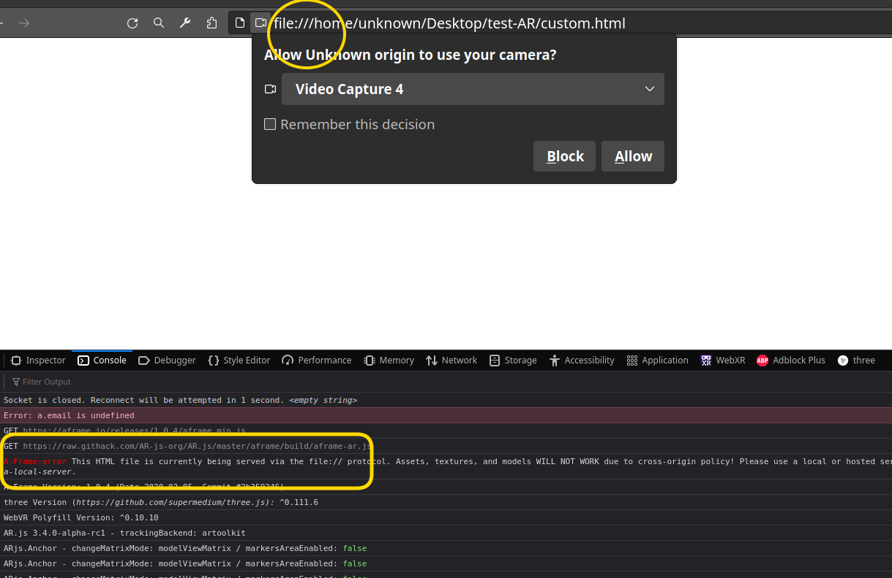
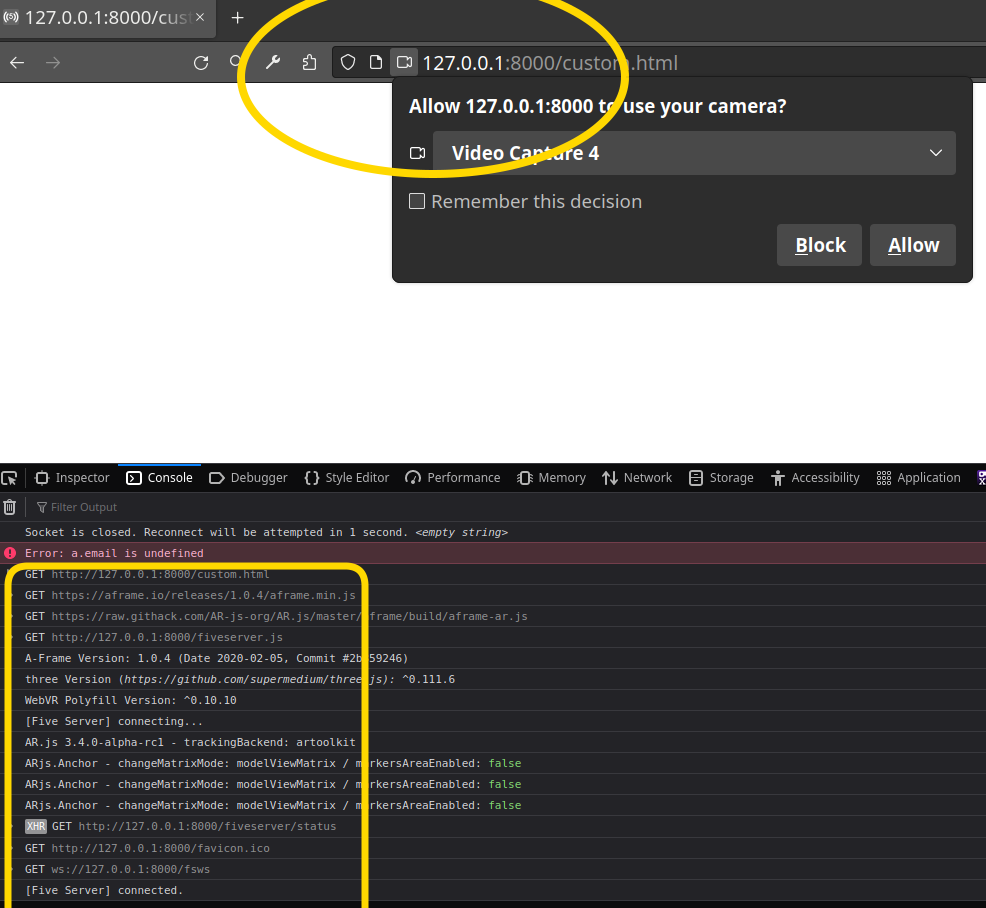

# QUIZ 3 - Message in a Bottle

## Quiz Steps To Complete

1. Can you run a local server? 
   - do that _now_ and open the `index.html` file

   HINT - This is not correct:

   

   ---

   THIS IS:

   

2. Take a screenshot and save that as `my-local-server`
   - put it in the `screencaps/` folder

3. Use `F12` when your server is running and you have loaded `index.html`
   - take a screenshot of the `console` information and content (save it)
   - convince yourself there are no errors and everything will run

4. Edit the `index.html` file and add an `<a-entity>` and `<a-camera>` that will let you _simulate_ latitude and longitude (_and_ altitude but you have do that separately)
   - if you think you don't know how to do this then you didn't read Quiz 3 repo resources' README.md located in `resources/`
   - you'll need some content to display

5. Open up `script.js`. Add your own `documentation` comments _one for each line with text_ describing what the script is doing per line. Now open `extending_script.js`. Add comments here for each line as well. At the end of this file however, create one multi-line comment summarizing where and how this script uses `objects` in an `object-oriented` style.
   - Indicate how and where you would handle a model's scale, and rotation, in code.
   - How would you add more models, and where would you need to add code to handle them?
   - How and where would you add event listeners? buttons for interaction? There are some `snippets` you could look at. You don't have to integrate them for now.

6. Rotation, Position, Scale: You can change a lot of attributes so try to tune them according to your personal taste. For each property, the triple of values represents the property expressed in the X,Y and Z coordinates. Rotation is expressed in degrees, position in meters, and scale is relative to initial scale (default to 1). Take your content from `Step 4.`. _We are not using markers, so don't use any_ (but you can test if the model loads this way if you want).
   - Can you position 4 separate copies of the same model? When you are done `Step 5` you should have 4 objects displaying at the same time in the scene.
   - Remember to always adjust a different parameter and value.
     - indicate one as the 'initial' or 'default'. Take a screencap. Save it.
     - adjust the _position_ of the first copy. Take a screencap. Save it.  
     - adjust the _rotation_ of the second copy. Also adjust its position. We don't want the models overlapping. Take a screencap. Save it.
     - adjust the _scale_ of the third copy. Also adjust its rotation. And then change its position to a new location. Take a screencap. Save it.
   - You might want to test outside. The screencaps will probably have to be taken with your mobile. But there are ways to display in browser.
   - You could deploy on GitHub pages, host on Heroku to test IRL outside on a mobile
  
   Do you think you could implement taking screenshots programatically, using this: 
   - `document.querySelector('a-scene').components.screenshot.capture('perspective')` ?

   Do you think you could load the models via `JavaScript` instead of hard-coded in the `HTML`?
   - what about loading them at different positons? There are some `JavaScript` code snippets you could integrate.
   
---

You can get up to 4/5 for the content above. Want 5? Try `Step 7`:

7. Customize `<a-scene>`. Can you make objects appear or disappear? Depending on location? Interaction? Can you change the content dynamically? Maybe over time, or over a distance travelled? Sound? Video? There are code snippets for including `UI/UX`, add some! Integrate an API? You don't have to use the same content from `Step 4` and `Step 5` for the final submission content you will submit to be sent to others.

---

8. To submit the Quiz, you will need to understand the scale, orientation, and dynamic properties of your content. You will need to document this information in your README.md file. Indicate what your content is, and the `position=` `rotation=` `scale=` values, as well as if you were able to integrate content affected by your change in position. (I will mostly use this information to plan the repo we will all visit to see a message from someone else near you instead!). I also need you to submit `GPS` coordinates somewhere you would like to visit for your surprize content (preferably the same place you tested for clear signal developing your own `AR` scene if you went outside!). `GPS` Latitude and Longitude should start with 5-6 decimals (.xxxxx) and when you test positioning content adjust it by ~0.0004 degrees at a time.
